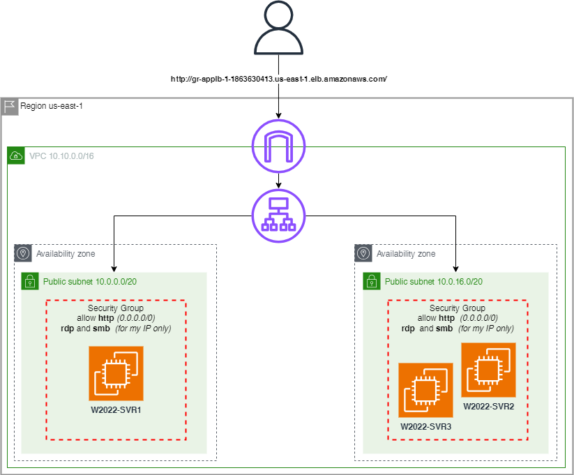

# Setting up a website on Cloud
## Course-end Project 2

Description

You are a Cloud engineer. Your company has brought in a new client who has got a website. However, they need a web server so that they can run their website completely on Cloud. Once the web server is up and running, they want you to configure the Cloud so that testing of the web server can be completed successfully.
 
Steps to Perform:

- Create an EC2 instance (OS: Windows 2012 R2 Base)
- Install IIS server role
- Create a static website and check on a localhost
- Create an image of the machine and save the AMI
- Create a new instance using the AMI you have saved
- Create a Load Balancer and attach the instances you have done before
- Check the DNS name on the browser

### Schema
